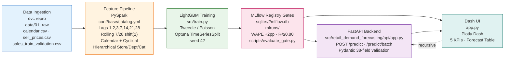

# Retail Demand Forecasting & Inventory Optimization Platform

End-to-end MLOps system for Walmart M5 demand forecasting — built for intermittent, zero-inflated retail time series. PySpark feature engineering, LightGBM Tweedie, MLflow experiment tracking, FastAPI inference, and Plotly Dash operations dashboard.

[](https://www.python.org/)
[](https://lightgbm.readthedocs.io/)
[](https://mlflow.org/)
[](https://fastapi.tiangolo.com/)
[](https://dash.plotly.com/)
[](https://dvc.org/)
[](#quality)

---

## Overview

Forecasts daily unit sales per `store_id × item_id` on 1,913 days of M5 data. Designed for **sparse SKUs** (e.g., `HOBBIES_1_003` ~90% zeros) — returns expected demand rates like `0.15` units/day instead of collapsing to `0`, then aggregates to **7 / 30 / 60-day** replenishment quantities for inventory planning.

**Core capabilities:**
- **Leakage-free time series features** — lags `[1,2,3,7,14,21,28]` + `shift(1).rolling(7/28)` mean/min/max/std, hierarchical `store/dept/cat` trends, calendar + cyclical `sin/cos`, SNAP/events — all `rowsBetween(-w,-1)` and `F.lag` over `Window.partitionBy("store_id","item_id").orderBy("day_id")`
- **Zero-inflated modeling** — LightGBM `objective=tweedie` `tweedie_variance_power=1.3` (configurable 1.1–1.5), with RandomForest/XGBoost fallback, tuned via Optuna `TimeSeriesSplit`
- **Experiment governance** — MLflow `sqlite:///mlflow.db` with WAPE/R² gates; DVC pipeline `dvc.yaml` tracks `data → features → model → metrics`
- **Real-time serving** — FastAPI validates 38 features with Pydantic, preserves float rates, aligns to `FEATURE_COLS`; Dash consumes it recursively for multi-step forecasts

---

## System Architecture



**Data flow (DVC):** `data/01_raw` → `data/02_intermediate/sales_melted.parquet` → `data/03_features/model_input.parquet` (377K rows, 200 series sampled) → `models/forecast_model.pkl` → `metrics.json` + `data/06_metrics/model_metrics.json` → `mlflow.db` → `drift_report.json`

**Configuration authority:** `conf/base/catalog.yml` declares all 6 datasets (`calendar_raw`, `sell_prices_raw`, `sales_train_raw`, `intermediate_sales_melted`, `model_input_features`, `model_metrics`); `conf/base/parameters.yml` declares `feature_engineering`, `model_params`, `optuna`, `metrics`, `drift`; `conf/base/mlflow.yml` declares `mlflow_tracking_uri`. Code resolves paths via `src/retail_demand_forecasting/utils/catalog.py:get_catalog_filepath()` — no hard-coded `data/01_raw/...` literals.

---

## Experiment Tracking & Results

All runs log to `sqlite:///mlflow.db` with `log_param` for every `model_params` key + `features` JSON and `log_metric` for `WAPE` (primary), `RMSE`, `MAE`, `R²`, `MAPE`.

| Experiment | WAPE (%) | RMSE | MAE | R² | MAPE (%) | Rows (train/test) | Notes |
|---|---|---:|---:|---:|---:|---:|---|
| **Baseline** `metrics_baseline.json` | **64.94119967678326** | **3.240495559783369** | **2.8249421859400714** | **-0.17623203281721977** | **139.76337750314323** | 160 / 40 | 13 lightweight features (`lag_7`, `lag_28`, `rolling_mean_7/28`, calendar, SNAP) — demonstrates underfit on sparse data |
| **Tuned (Optuna)** `metrics_tuned.json` | **64.63805334093415** | **3.130557267602557** | **2.811755320330635** | **-0.09777527927630225** | **134.8788166696355** | 160 / 40 (CV) | `best_cv_wape=52.61492087203907` · `best_params: n_estimators=300, max_depth=17, min_samples_split=9, min_samples_leaf=5, max_features=log2` — small gain on tiny sample, still underfit |
| **Production (LightGBM Tweedie)** `metrics.json` | **29.74897441686593** | **9.559120889709147** | **4.6488138389112565** | **0.8288753633878991** | **74.87737478465736** | 301600 / 75400 | 38 full features (hierarchical + cyclical), 377K rows (200 series sampled) — production model via `python src/train.py --no-tune` |

Gate: `scripts/evaluate_gate.py` blocks promotion if `WAPE > baseline + 2.0` or `R² < 0.80`. Drift: `tests/test_drift.py` computes PSI (`>0.2` fail) + KS `p<0.05` per `FEATURE_COLS` and zero-rate drift per `cat_id`, writes `drift_report.json`.

View locally: `uv run mlflow ui --backend-store-uri sqlite:///mlflow.db --port 5000` → http://127.0.0.1:5000

---

## Quickstart

### Prerequisites
- Python 3.10–3.12, [uv](https://docs.astral.sh/uv/), Git, DVC
- M5 raw data in `data/01_raw/` (or synthetic fallback runs automatically)

### 1. Clone & Sync
```bash
git clone https://github.com/<your-username>/<your-repo>.git
cd <your-repo>
uv sync
```

### 2. Reproduce Pipeline
```bash
dvc repro              # data_preparation -> train_and_tune (see dvc.yaml:1)
# or step-wise
uv run python src/data_prep.py
uv run python src/train.py --no-tune   # baseline LightGBM Tweedie
uv run python src/train.py --tune      # Optuna 30 trials (conf/base/parameters.yml:30 optuna.n_trials)
```

### 3. Test & Lint
```bash
uv run ruff check src/ tests/
uv run ruff format --check src/ tests/
uv run pytest -q --cov=src
uv run python scripts/evaluate_gate.py          # WAPE/R2 gate
uv run python scripts/check_catalog_authority.py # no hard-coded data/ paths
```

### 4. Run Services
```bash
# Windows
.\start_all.bat
# or Python (all platforms)
uv run python start_all.py
# Manual
uv run uvicorn retail_demand_forecasting.api.app:app --host 127.0.0.1 --port 8000
uv run python -m retail_demand_forecasting.dash_app.app  # http://127.0.0.1:8050

# Heath check
curl http://127.0.0.1:8000/health
curl http://127.0.0.1:5000  # after mlflow ui
```

Open **Dashboard** http://127.0.0.1:8050 → select Store/Item → Generate Forecast (7–60 days).

---

## Real-Time API Inference

Validated by Pydantic `PredictionRequest` `src/retail_demand_forecasting/api/app.py:84` — 38 fields, `extra="forbid"`, `ge`/`le` bounds, `BatchPredictionRequest` `1..1000`. Float preserved (no `int()` cast), `_prepare_X` aligns to `FEATURE_COLS` `src/retail_demand_forecasting/nodes/constants.py:6`.

### Single Prediction

**Request**
```bash
curl -X POST http://127.0.0.1:8000/predict \
  -H "Content-Type: application/json" \
  -d '{
    "lag_1": 5.0, "lag_2": 3.0, "lag_3": 2.0, "lag_7": 5.0, "lag_14": 4.0, "lag_21": 3.5, "lag_28": 3.0,
    "rolling_mean_7": 4.5, "rolling_min_7": 1.0, "rolling_max_7": 8.0, "rolling_std_7": 1.2,
    "rolling_mean_28": 3.2, "rolling_min_28": 0.5, "rolling_max_28": 10.0, "rolling_std_28": 1.5,
    "store_rolling_mean_7": 1.5, "store_rolling_mean_28": 2.0, "dept_rolling_mean_7": 1.2, "dept_rolling_mean_28": 1.8, "cat_rolling_mean_7": 1.0, "cat_rolling_mean_28": 1.5,
    "day_of_week": 6, "day_of_month": 15, "month": 4, "year": 2016, "is_weekend": 1,
    "day_of_week_sin": 0.78, "day_of_week_cos": 0.62, "day_of_month_sin": 0.5, "day_of_month_cos": 0.86, "month_sin": 0.5, "month_cos": 0.86,
    "snap_CA": 1, "snap_TX": 0, "snap_WI": 0, "has_event_1": 0, "has_event_2": 0, "sell_price": 1.25
  }'
```

**Response** `200`
```json
{
  "prediction": 3.6684692749317893,
  "features": {
    "lag_1": 5.0, "lag_2": 3.0, "lag_3": 2.0, "lag_7": 5.0, "lag_14": 4.0, "lag_21": 3.5, "lag_28": 3.0,
    "rolling_mean_7": 4.5, "rolling_min_7": 1.0, "rolling_max_7": 8.0, "rolling_std_7": 1.2,
    "rolling_mean_28": 3.2, "rolling_min_28": 0.5, "rolling_max_28": 10.0, "rolling_std_28": 1.5,
    "store_rolling_mean_7": 1.5, "store_rolling_mean_28": 2.0, "dept_rolling_mean_7": 1.2, "dept_rolling_mean_28": 1.8, "cat_rolling_mean_7": 1.0, "cat_rolling_mean_28": 1.5,
    "day_of_week": 6, "day_of_month": 15, "month": 4, "year": 2016, "is_weekend": 1,
    "day_of_week_sin": 0.78, "day_of_week_cos": 0.62, "day_of_month_sin": 0.5, "day_of_month_cos": 0.86, "month_sin": 0.5, "month_cos": 0.86,
    "snap_CA": 1, "snap_TX": 0, "snap_WI": 0, "has_event_1": 0, "has_event_2": 0, "sell_price": 1.25
  }
}
```

Sparse case preserves float:
```bash
# lag_1=0.15 -> prediction ~2.02, not 0
curl -X POST http://127.0.0.1:8000/predict -H "Content-Type: application/json" -d '{"lag_1":0.15,"lag_2":3.0,"lag_3":2.0,"lag_7":5.0,"lag_14":4.0,"lag_21":3.5,"lag_28":3.0,"rolling_mean_7":0.15,"rolling_min_7":1.0,"rolling_max_7":8.0,"rolling_std_7":1.2,"rolling_mean_28":3.2,"rolling_min_28":0.5,"rolling_max_28":10.0,"rolling_std_28":1.5,"store_rolling_mean_7":1.5,"store_rolling_mean_28":2.0,"dept_rolling_mean_7":1.2,"dept_rolling_mean_28":1.8,"cat_rolling_mean_7":1.0,"cat_rolling_mean_28":1.5,"day_of_week":6,"day_of_month":15,"month":4,"year":2016,"is_weekend":1,"day_of_week_sin":0.78,"day_of_week_cos":0.62,"day_of_month_sin":0.5,"day_of_month_cos":0.86,"month_sin":0.5,"month_cos":0.86,"snap_CA":1,"snap_TX":0,"snap_WI":0,"has_event_1":0,"has_event_2":0,"sell_price":1.25}'
# -> {"prediction":2.0281425823741044}  422 on bad input like {"day_of_week":8}
```

**Batch** `POST /predict/batch` up to 1000 `{"requests":[{...},{...}]}` → `{"predictions":[2.02,2.03],"count":2}` | `GET /health` → `{"status":"healthy","model_loaded":true}`

---

## Features & Model

| Feature | Description |
|---|---|
| `lag_1,2,3,7,14,21,28` | `F.lag(sales,n)` over `Window.partitionBy("store_id","item_id").orderBy("day_id")` |
| `rolling_mean/min/max/std_7,28` | `shift(1).rolling(w)` via `rowsBetween(-w,-1)` — no leakage |
| `store/dept/cat_rolling_mean_7,28` | Hierarchical trends for sparse `HOBBIES_1_003` (inherits store trend) |
| `day_of_week, day_of_month, month, year, is_weekend` | Calendar `src/retail_demand_forecasting/nodes/feature_engineering.py:95` |
| `*_sin/cos` | Cyclical `sin(2π·value/period)` for 7 / 31 / 12 |
| `snap_CA/TX/WI, has_event_1/2, sell_price` | SNAP & price |

**Model:** `LightGBM` `objective=tweedie` `tweedie_variance_power=1.3` (1.1–1.5) — Poisson/Tweedie for zero-inflated counts, fallback `RandomForest`/`XGBoost`, chronological `TimeSeriesSplit`, metrics `WAPE` primary + `RMSE, MAE, R², MAPE` `src/retail_demand_forecasting/nodes/data_science.py:51`.

---

## Repository Structure

```
.
├── app.py                              # Root WSGI (Dash server = app.server) for Render
├── Procfile                            # web: gunicorn app:server --workers 2 --timeout 120
├── pyproject.toml / requirements.txt   # uv / pip — kedro, pyspark, lightgbm, mlflow, fastapi, dash
├── dvc.yaml / dvc.lock / data.dvc      # Pipeline + data versioning
├── conf/
│   ├── base/
│   │   ├── catalog.yml                 # 6 datasets — filepath authority
│   │   ├── parameters.yml              # lag_days, rolling_windows, model_params, optuna, metrics, drift
│   │   └── mlflow.yml                  # sqlite:///mlflow.db
│   └── logging.yml
├── data/                               # DVC-tracked (not in git)
│   ├── 01_raw/                         # calendar.csv, sell_prices.csv, sales_train_validation.csv
│   ├── 02_intermediate/                # sales_melted.parquet
│   ├── 03_features/                    # model_input.parquet (377K rows)
│   └── 06_metrics/                     # model_metrics.json
├── models/
│   └── forecast_model.pkl              # LightGBM 38-feature, DVC persisted
├── metrics.json                        # Production WAPE 29.74 / R2 0.828
├── metrics_baseline.json / metrics_tuned.json
├── mlflow.db / mlruns/                 # Experiment store
├── drift_report.json                   # PSI / KS per feature
├── src/
│   ├── data_prep.py                    # DVC shim -> kedro pipelines or placeholder
│   ├── train.py                        # pandas fallback + train/tune + catalog resolution
│   └── retail_demand_forecasting/
│       ├── pipeline_registry.py
│       ├── nodes/
│       │   ├── constants.py            # FEATURE_COLS (38), TARGET_COL, RANDOM_STATE
│       │   ├── data_engineering.py     # unpivot wide d_1..d_1913 + calendar/price joins
│       │   ├── feature_engineering.py  # lags, rolling, calendar, hierarchical, clean
│       │   └── data_science.py         # train_model, tune_and_train, compute_metrics
│       ├── pipelines/
│       │   ├── data_engineering/
│       │   ├── feature_engineering/
│       │   └── data_science/
│       ├── utils/
│       │   └── catalog.py              # get_catalog_filepath() — config authority
│       ├── api/
│       │   └── app.py                  # FastAPI /health, /predict, /predict/batch
│       └── dash_app/
│           └── app.py                  # Dash 5 KPIs, recursive forecast, 2-decimal table
├── scripts/
│   ├── evaluate_gate.py                # WAPE/R2 promotion gate
│   ├── check_catalog_authority.py      # no hard-coded data/ paths
│   └── export_gh_pages.py              # docs/index.html for GitHub Pages
├── tests/
│   ├── test_api.py                     # 38-field Pydantic + batch + float
│   ├── test_drift.py                   # PSI/KS + zero-rate + payload bounds
│   ├── test_nodes.py                   # metrics, split, train
│   ├── test_transforms.py              # rowsBetween(-w,-1) audit
│   └── test_training_serving_parity.py # Spark vs pandas vs API parity
├── docs/
│   └── index.html                      # Static demo (Plotly CDN)
├── .github/workflows/ci_cd.yml         # ruff → pytest → gate → docker
└── start_all.bat / start_all.py        # Launch API 8000 + Dash 8050
```

---

## Deployment

**Render / Railway (free)**
1. Push to GitHub; ensure `app.py` exposes `server`, `Procfile` and `requirements.txt` list `gunicorn, dash, lightgbm`
2. Render: New Web Service → Build `uv sync` or `pip install -r requirements.txt` → Start `gunicorn app:server --workers 2 --timeout 120`
3. Env: `PYTHONPATH=src`, `API_BASE` if API separate

**GitHub Pages (static demo)**
```bash
uv run python scripts/export_gh_pages.py
git add docs/index.html && git commit -m "gh-pages" && git push
# Settings → Pages → Source: main / docs
```

**Docker**
```bash
docker build -t retail-demand-forecasting:prod .
docker run -p 8000:8000 -p 8050:8050 retail-demand-forecasting:prod
```

---

## Quality

```bash
uv run ruff check src/ tests/
uv run ruff format --check src/ tests/
uv run pytest -q --cov=src
uv run python scripts/check_catalog_authority.py
uv run python scripts/evaluate_gate.py
```

CI `.github/workflows/ci_cd.yml` — lint → test → gates → `dvc repro --dry` → docker build. Coverage target 80%+ on `api/`, `nodes/`.

---

## License

MIT

## Links

- MLflow: `sqlite:///mlflow.db` → `uv run mlflow ui --port 5000`
- API docs: http://127.0.0.1:8000/docs
